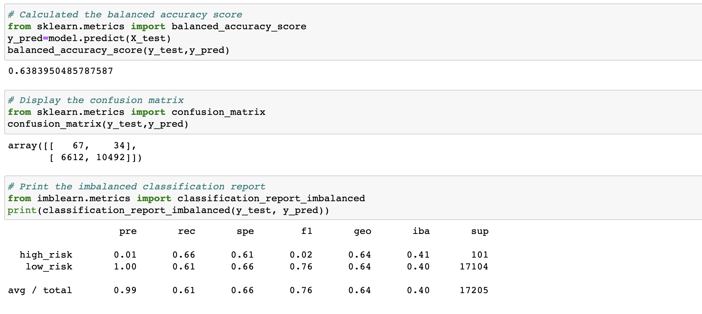
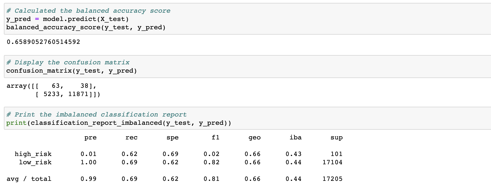
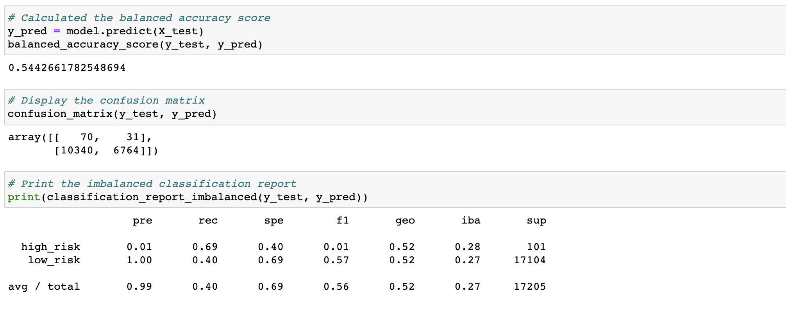
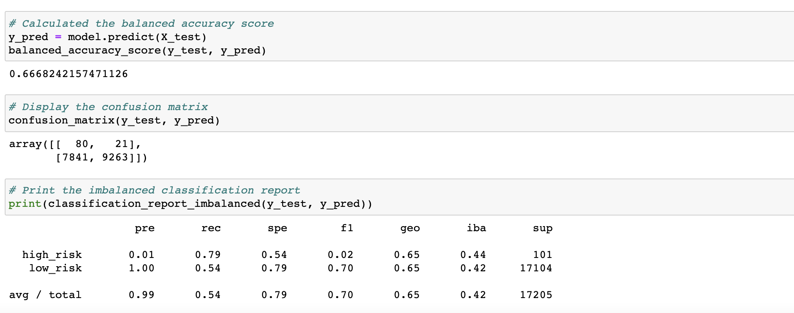
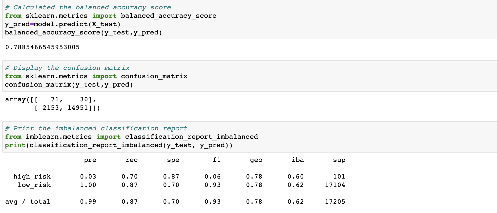
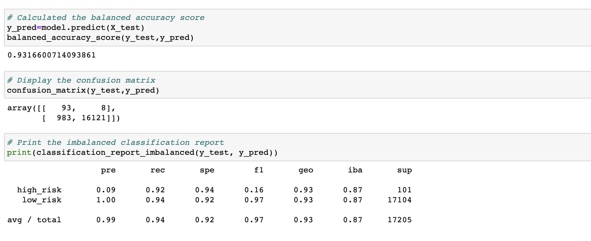

# Credit_Risk_Analysis

## Overview of the analysis

### Purpose

The purpose of this project is using different resampling techniques and machine learning models in order to evaluate the performance of these models and determine the best model that should be used to predict credit risk.

## Results

### Native Random Oversampling followed by Logistic Regression model

- Balanced accuracy score: 0.638
- Precision score: 
  - High risk: 0.01
  - Low risk: 1 
- Recall score
  - High risk: 0.66
  - Low risk: 0.61

### SMOTE Oversampling followed by Logistic Regression model

- Balanced accuracy score: 0.659
- Precision score: 
  - High risk: 0.01
  - Low risk: 1
- Recall score
  - High risk: 0.62
  - Low risk: 0.69

### Cluster Centroids Undersampling followed by Logistic Regression model

- Balanced accuracy score: 0.544
- Precision score: 
  - High risk: 0.01
  - Low risk: 1
- Recall score
  - High risk: 0.69
  - Low risk: 0.40

### SMOTEENN Combination Sampling followed by Logistic Regression model

- Balanced accuracy score: 0.667
- Precision score: 
  - High risk: 0.01
  - Low risk: 1
- Recall score
  - High risk: 0.79
  - Low risk: 0.54

### Balanced Random Forest Classifier

- Balanced accuracy score: 0.789
- Precision score: 
  - High risk: 0.03
  - Low risk: 1
- Recall score
  - High risk: 0.70
  - Low risk: 0.87

### Easy Ensemble AdaBoost Classifier

- Balanced accuracy score: 0.932
- Precision score: 
  - High risk: 0.09
  - Low risk: 1
- Recall score
  - High risk: 0.92
  - Low risk: 0.94

## Summary

By comparing the results among resampling techniques (oversampling, undersampling, and combination sampling), in this specific dataset, we can conclude that combination sampling is the most efficient technique to deal with class imbalance. 

Since low-risk is the majority class, therefore, this pronounced imbalance between high-risk and low-risk classes could cause machine learning models to be biased toward the low-risk class. The balanced accuracy score slightly increased to 0.667 and the sensitivity score for minority class (high-risk) increased to 0.79 by using the combination sampling technique. Also, for credit risk prediction, a high value of sensitivity score for high-risk cases is more important than the precision score.

### Recommondation

Since a high recall score is more important in this analysis, among all six machine learning models, I recommend to use Easy Ensemble AdaBoost Classifier model (The balanced accuracy score and recall score for both classes are above 90%) to predict the credit risk.
